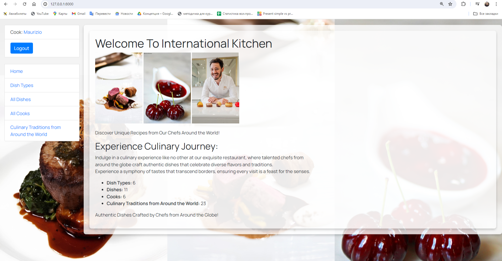

# international-kitchen

Project for managing the kitchen where cooks from different countries are working together can create 
new dishes & dish types to improve the communication & rules between cooks in the kitchen and provide 
more information to the clients about the cook and his origin and the dish.

## Check it out!

[international kitchen project  deployed to Render] (https://international-kitchen.render.com/)

## Installation

Python3 must be already installed 

shell

git clone https://github.com/Irina17191/international-kitchen/tree/main

cd international-kitchen

python3 -m venv venv

source venv/bin/activate

pip install -r requirements.txt

python manage.py runserver    # starts Django Server

# Features

* Authentication functionality for Cook/User
* Managing dishes, dish types and cooks directly from website interface
* Admin panel for advanced managing

## Demo

