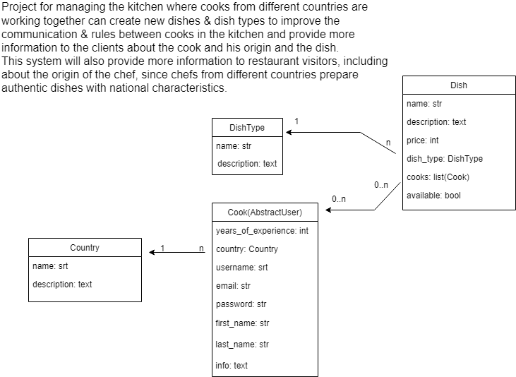
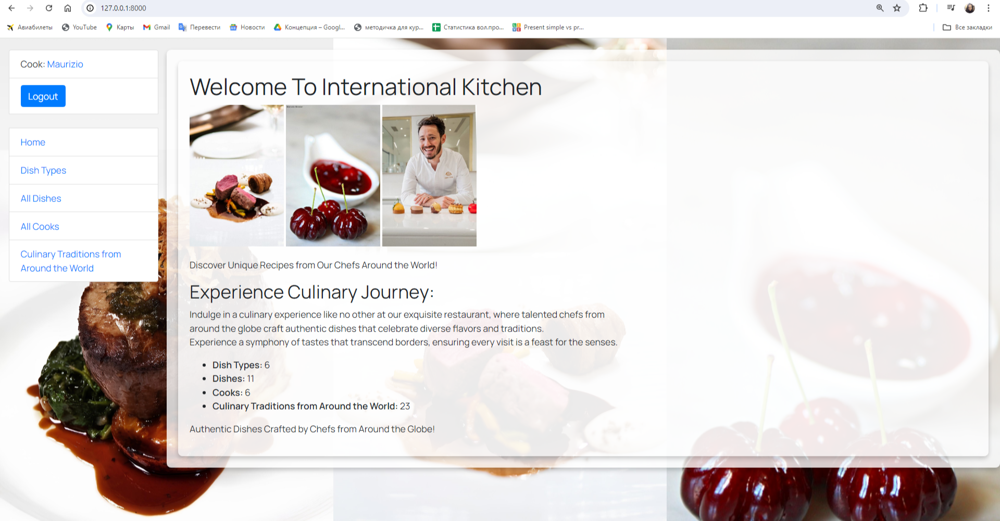
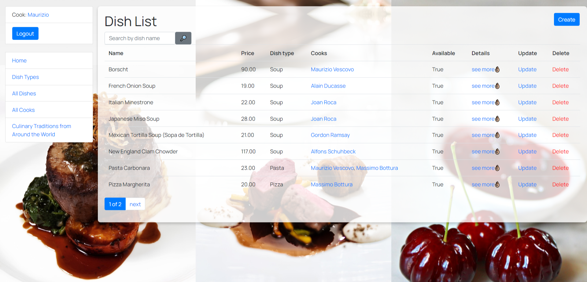
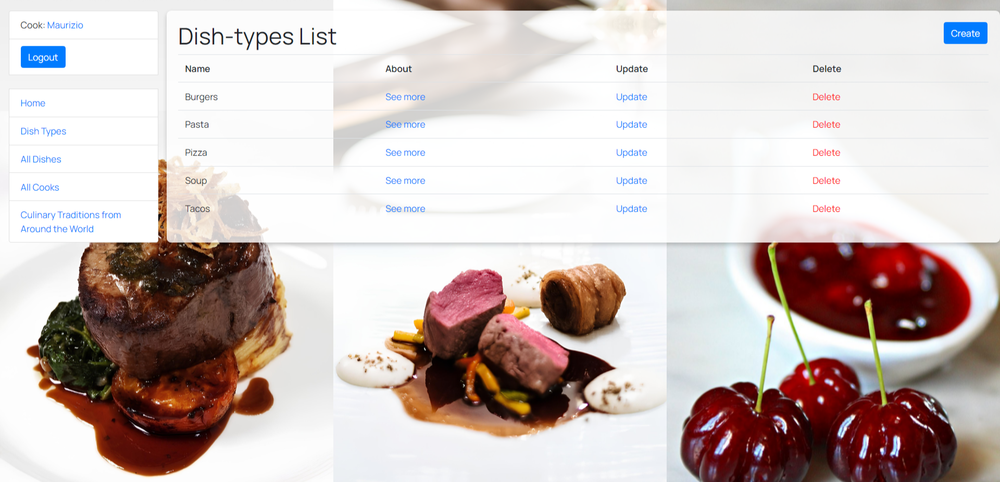

# international-kitchen

Project for managing the kitchen where cooks from different countries are working together can create  
new dishes & dish types to improve the communication & rules between cooks in the kitchen and provide  
more information to the clients about the cook and his origin and the dish.  

## Check it out!

[international kitchen project  deployed to Render] (https://international-kitchen.onrender.com/)

## Installation / Getting started

Python3 must be already installed 

git clone https://github.com/Irina17191/international-kitchen/tree/develop  
cd international-kitchen  
python3 -m venv venv  
source venv/bin/activate  
pip install -r requirements.txt  
python manage.py migrate  
python manage.py runserver  

If you run this commands you will have project without data

You can use these credentials to login or create new superuser:  
Login: admin  
Password: 12345Adminpassword  

## Installation / Environment variables and static files  

To start this project you also need to install environment variables   
In project root you have .env.template you should make your own .env file  
You can use the command below to load .env automatically  
source ./load_env.sh  

You also should load static files if you want to use project with DEBUG=False  
To load it run this command  
python manage.py collectstatic --no-input    

# Features

International Kitchen is a web application developed using Django that manages a kitchen where chefs from various countries are working.   
The project aims to enhance communication and establish clear rules among chefs.  

* Authentication/Registration functionality for Cook/User
* CRUD Operations
* Managing dishes, dish types and cooks directly from website interface
* Admin panel for advanced managing
* Filtering: Search and filter dishes by name and dish type
* Static Files: Includes CSS for styling and images for visual elements
* Form Creation involves custom validation and extended fields to meet the specific needs of managing dishes and chefs
* Templates: Utilizes template inheritance to maintain consistency and reusability across pages (e.g., base.html, sidebar.html)
* User-friendly interface

## Project structure and Demo:

 

 

 

